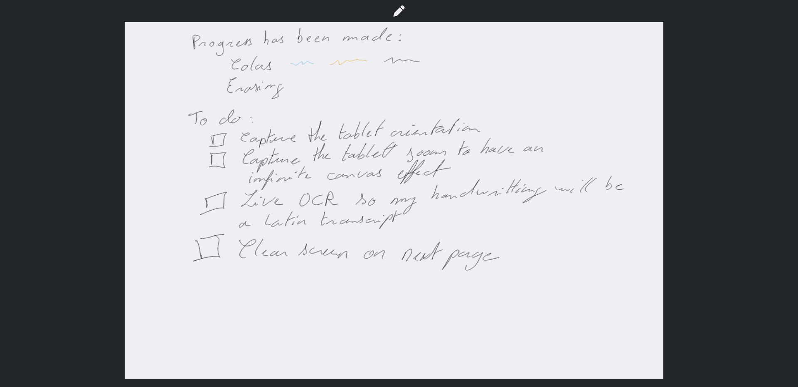

# Pipes and paper enhanced

This is the fork of the [pipes-and-paper experiment](https://gitlab.com/afandian/pipes-and-paper/-/tree/master) by Joe Wass.

This project aims to enable screen sharing between the ReMarkable tablet and a browser, without having an account on ReMarkable, nor having anything to install on the device itself, nor having the desktop app.

Copies pen strokes, not the contents of the screen, but that's fine for live-sharing sketches.

Tested on Linux, Mac probably works fine, with the ReMarkable 2.

## Features

- [x] Write with the stylus (contributions from [Joe Wass](https://gitlab.com/afandian))
- [x] Erase with the stylus (contributions from [Alex Riesen](https://gitlab.com/raalkml))
- [x] Change color (with <kbd>1</kbd> to <kbd>8</kbd>) (contributions from [Trevor Spiteri](https://gitlab.com/tspiteri))
- [x] Responsive interface
- [x] Clear the screen with <kbd>space</kbd> (contributions from [Joe Wass](https://gitlab.com/afandian))

**Planned features**

- [ ] Config to change ports and ReMarkable hostname, etc.
- [ ] Change canvas orientation according to the tablet portrait/landscape modes
- [ ] Capture zoom in/out to have kind-of infinite canvas
- [ ] Capture next page on tablet to clear the screen
- [ ] Live OCR to transcribe latin handwriting to font

## How to use

You'll need to do a little bit on the command-line. Assuming you have Python 3 installed.

Setup:

1. [Set up SSH private keys and config](https://remarkablewiki.com/tech/ssh) so that running `ssh rem` succeeds. This works via USB connection.
2. Install the requirements for the python script that runs on your computer:

- Optional: set a virtual environnement `python3 -m venv .venv`
- Optional: activate the virtual environnement `source .venv/bin/activate`
- Install the project dependencies `pip3 install -r requirements.txt`

To run:

1. `./run.sh`
2. Visit <http://localhost:8001/>

## Original motivation of Joe Wass

For quick white-boarding screenshare. The other solutions didn't quite work for me. 

 - The official one requires an account so I never tried it. 
 - [reStream](https://github.com/rien/reStream) captures the frame buffer but in the latest ReMarkable firmware crawls, giving about 0.5 fps.
 - This requires no compilation or execution on the tablet.

And I wanted a little project. Part of the reason I bought this tablet was the ability to hack it.

## How does it work?

The Remarkable tablet has access to the binary event stream for its input sensors in `/dev/input/event0`. It also allows SSH access. This streams the sensor data over SSH, parses the binary stream and sends it over a websocket to a browser.

The browser has some rudimentary smoothing, plus hover indicator.
